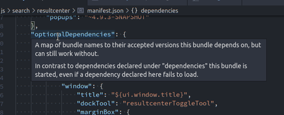
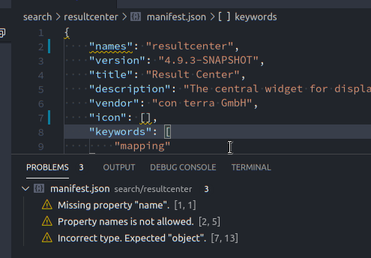

# Visual Studio Code extension for apprt bundles

Supports working with apprt bundles, especially when editing bundle _manifest.json_ files.

## Using the extension

1. Install the extension, either via Marketplace or downloading the `vsix` extension file release from this site.
2. Open a `manifest.json` file.
3. Take advantage of the features described below.

## manifest.json Features

### Documentation of properties

No idea what the property `"optionalDependencies"` is good for or what its effect is?
Just hover over any standard property to get additional information you otherwise needed to look up in the official docs.
Links inside the popups take you to the official docs directly if you need to know more.

### Validation

Syntactical validation of manifest.json files will help you find those "simple" errors that would cost you valuable time.
Find errors before your bundle gets loaded!

### Auto-completion & auto-suggest

Press CTRL+Space to get code-suggest and auto-complete for most of the properties.
Creating a new `"compomnent"` with `"references"` will only take a few seconds.

* _Auto-complete_ and _code suggest_ for manifest JSON structural elements

### Search service name references

Search for references to the service name under the current cursor.
Finds all occurences in other manifest.json files.

The search can be triggered by the following commands when your cursor is on a value for `"provides"` or `"providing"`:

* \> _Find all References_ (`Alt-Shift-F12`)
* \> _Go to References_ (`Shift-F12`)
* \> _Peek References_

### Service name completion

Auto-complete lists all service names available in the current context, when typing a value for `"provides"` or `"providing"`.
The list of service names is made up by all service names used in manifest.json files of the workspace (currently they are not taken from JAR files or other sources).

### Service name CodeLens

A "CodeLens" is displayed above any line containing a value for `"provides"` or `"providing"`.
The code lens displays the number of known references (for `"provides"`) and the number of known services (for `"providing"`) specifying the same service name.
Clicking on a lens opens the *Peek References* view inside the current file:

Code lenses are enabled by default but can be disabled permanently in the *Settings* under _> Extensions > apprt-bundles_

If you just want to enable or disable code lenses for service names temporarily, look for *"apprt-bundles: Toggle service name code lens"* in the *Command Palette*. 

## Upcoming

* Bundle navigation: Jump to the manifest of a bundle when clicking on an entry in the `"dependencies"` section of a manifest.
* Navigate to bundle from Command Palette by just giving the bundle name.
* Rename service names: Hit `F2` and rename all occurances of a service name

## Further ideas

See the [Developer Wiki](https://github.com/ctjdr/vscode-apprt-bundles/wiki/Implementation-Ideas) for a list of implementation ideas.
