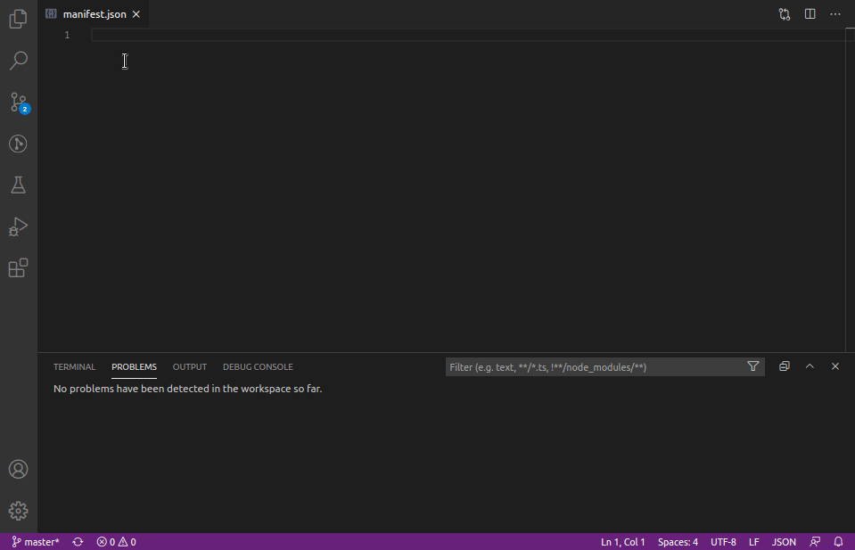
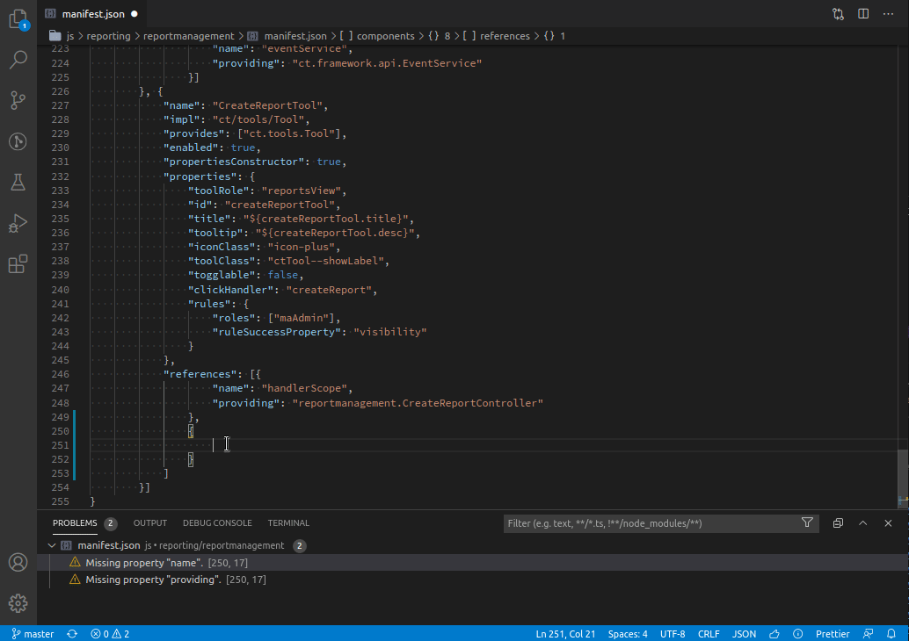

# Visual Studio Code extension for apprt bundles

Supports working with apprt bundles, especially when editing bundle _manifest.json_ files.

## Using the extension

1. Install the extension, either via Marketplace or downloading the `vsix` extension file release from this site.
2. Open a `manifest.json` file
3. press CTRL+Space to get code-suggest and auto-complete or hover over a property to get documention hints.

## Features

### Validation, documentation, auto-complete for JSON structure

This feature is implemented based on a JSON Schema file, defining the cornerstones of a manifest.json file.

* Structural _validation_ of manifest.json file
* _Documentation hints_ on manifest.json editing
* _Auto-complete_ and _code suggest_ for manifest JSON structure

### Search service references ("providing", "provides")

Search for references to the service name under the current cursor.
Finds all occurences in other manifest.json files.

The search can be triggered by the following commands:

* \> _Find all References_ (Alt-Shift-F12)
* \> _Go to References_ (Shift-F12)
* \> _Peek References_

### Service name completion ("providing", "provides")

Auto-comlete lists all service names available in the current context, when typing a value for `"provides"` or `"providing"`.
The list of service names available for completion is made up by all service names used in manifest.json files of the workspace (currently they are not taken from JAR files or other sources).

## Upcoming

* Service name references CodeLense: Click on a small link right above a `"provides"` or `"providing"` element to navigate to service name references.

## Further ideas

See the [Developer Wiki](https://github.com/ctjdr/vscode-apprt-bundles/wiki#developer-pages) for a list of implementation ideas.
