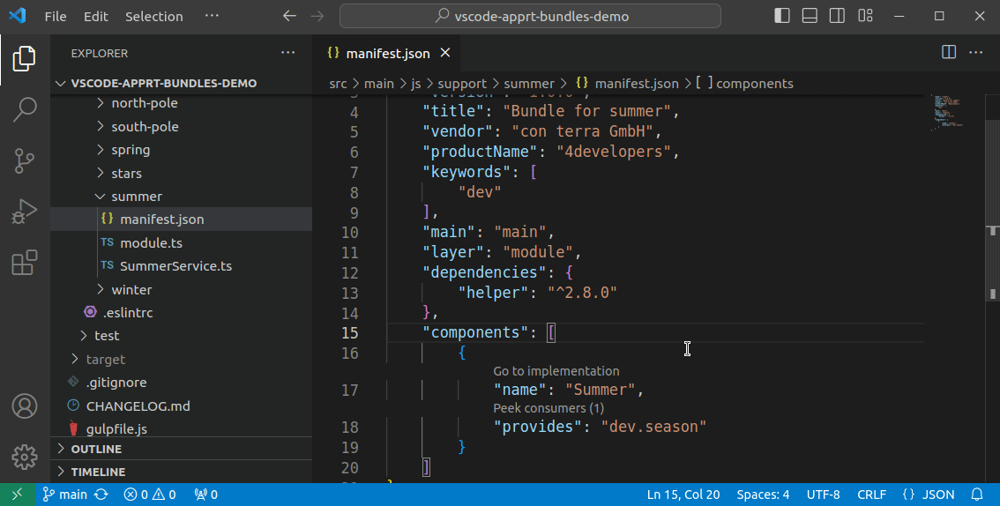

# Bundle navigation

Features provided by the extension that help you work with bundles:

- [Quick-open bundle](#quick-open-bundle)
- [Go to component implementation code lens](#go-to-component-implementation-code-lens)
- [Go to component definition (module file)](#go-to-component-definition-module-file)
- [Jump to manifest.json or README.md](#jump-to-manifestjson-or-readmemd)

## Quick-open bundle
Sometimes it takes more time than you expect to locate the bundle inside the file tree of VS Code. This is where *Quick-open bundle* comes to a rescue:

Press <kbd>Ctrl</kbd>+<kbd>ß</kbd> (as in "**ß**undle"), enter some parts of the bundle name, and the bundle folder will be highlighted in the file tree.
You may alternatively execute *> apprt-bundles: Open bundle* from the command palette.

The actual effect of *opening a bundle* can be customized in the settings.
The property `apprtbundles.bundles.reveal.goal.type` lets you select if
* the bundle folder is just highlighted,
* the bundle folder is highlighted and expanded, or
* the manifest.json file of the bundle folder is highlighted, which obviously requires to expand the folder. :smirk:

## Go to component implementation code lens

In a bundle manifest, click the *> Go to implementation* code lens above the `name` property of a component to open the corresponding implementation file.

## Go to component definition (module file)

In a bundle manifest, <kbd>Ctrl</kbd>+<kbd>Click</kbd> the `name` or `impl` property value of a component to open the `module.js` or `.ts` file, where it is imported or exported.

This is equivalent to pressing <kbd>F12</kbd> or executing the *> Go to Definition* command.

## Jump to manifest.json or README.md

The commands
* *> apprt-bundles: Open current manifest.json*
* *> apprt-bundles: Open current README.md*

allow you to open the respective file of the current bundle.
The "current" bundle is determined by the location of the file opened inside the active file editor. 

