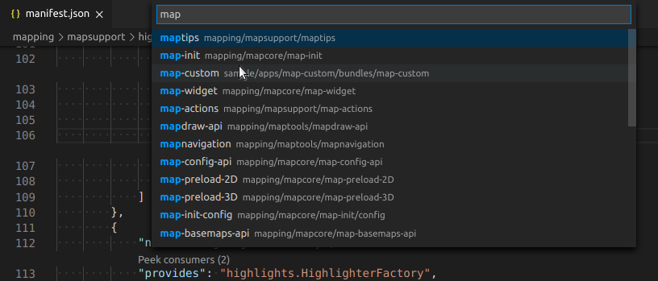

# Bundle navigation

Features provided by the extension that help you work with bundles:

- [Quick-open bundle](#quick-open-bundle)

## Quick-open bundle
Sometimes it takes more time than you expect to locate the bundle inside the file tree of VS Code. This is where *Quick-open bundle* comes to a rescue:

Execute **apprt-bundles: Open bundle** from the command palette, enter some parts of the bundle name, and the bundle folder will be highlighted in the file tree.

The actual effect of *opening a bundle* can be customized in the settings.
You can select if
* the bundle folder is just highlighted,
* the bundle folder is highlighted and expanded (`apprtbundles.bundles.reveal.goal.expandFolder`),
* the manifest.json file of the bundle folder is highlighted, which obviously requires to expand the folder :smirk: (`apprtbundles.bundles.reveal.goal.type`).