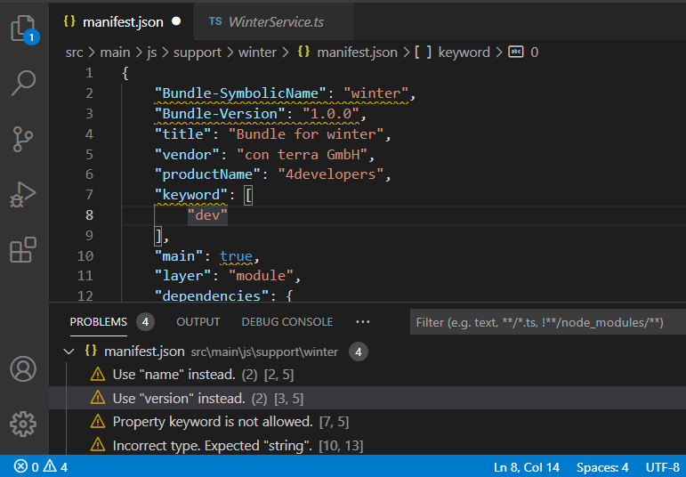
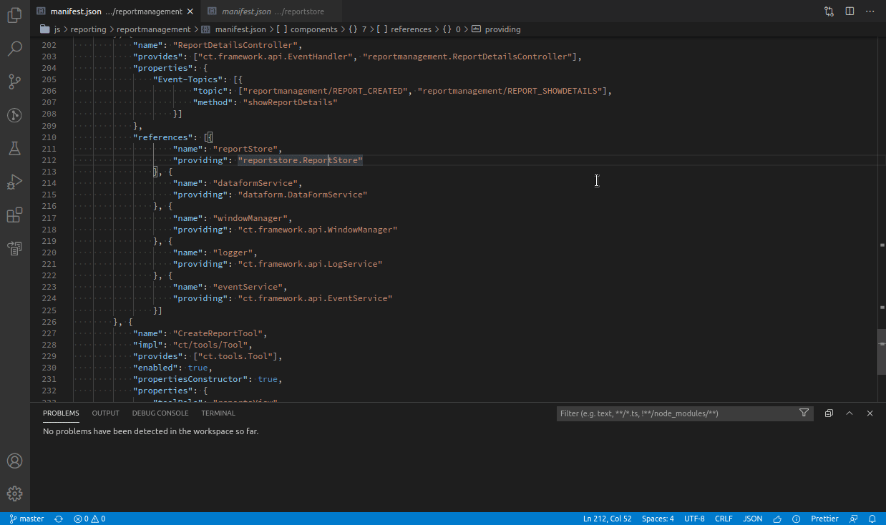
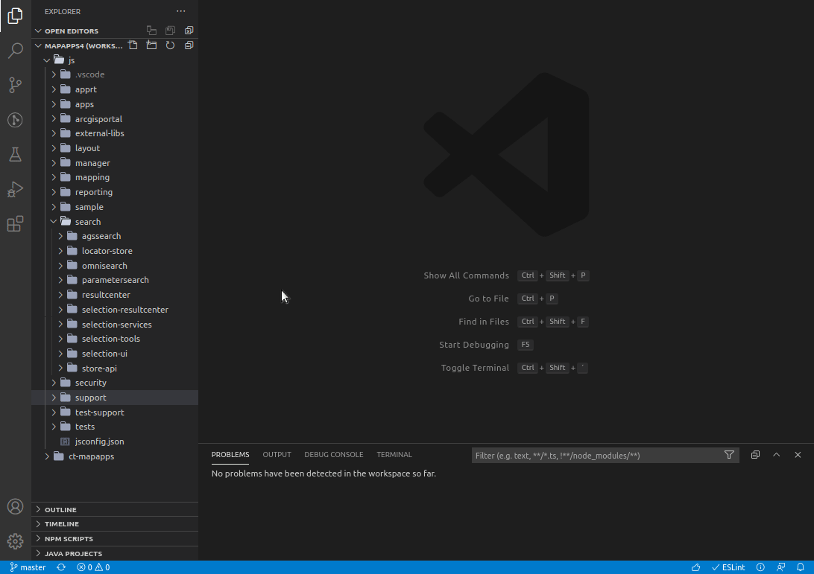

# manifest.json editing

Features provided by the extension that help editing `manifest.json` files are:

- [Documentation of properties](#documentation-of-properties)
- [Validation](#validation)
- [Auto-completion & auto-suggest](#auto-completion--auto-suggest)
- [Service names: _provides_ & _providing_](#service-names-provides--providing)
  - [References search](#references-search)
  - [Auto-completion](#auto-completion)
  - [CodeLenses](#codelenses)

## Documentation of properties

No idea what the property `"optionalDependencies"` is good for or what its effect is?
Just hover over any standard property to get additional information you otherwise needed to look up in the official docs.
Links inside the popups take you to the official docs directly if you need to know more.

Sometimes you might want to hide those documentation hints because you already now them by heart :nerd_face:.
In that case you can use the command *> apprt-bundles: Toggle manifest documentation* to switch documentation hovers on and off.

To get rid of them permanently, set `apprtbundles.manifest.documentationTooltips.enabled` to `false` in the settings.

## Validation

Syntactical validation of manifest.json files will help you find those "simple" errors that would cost you valuable time.
Find errors and deprecated keys before your bundle gets loaded!

## Auto-completion & auto-suggest

Press <kbd>Ctrl</kbd>+<kbd>Space</kbd> to get code-suggest and auto-complete for most of the properties.
Creating a new `"component"` with `"references"` will only take a few seconds.

## Service names: _provides_ & _providing_

### References search

Search for references to the service name under the current cursor.
Finds all occurences in other manifest.json files.

The search can be triggered by the following commands when your cursor is on a value for `"provides"` or `"providing"`:

* \> _Find all References_ (<kbd>Alt</kbd>+<kbd>Shift</kbd>+<kbd>F12</kbd>)
* \> _Go to References_ (<kbd>Shift</kbd>+<kbd>F12</kbd>)
* \> _Peek References_

### Auto-completion

Auto-complete lists all service names available in the current context, when typing a value for `"provides"` or `"providing"`.
The list of service names is made up by all service names used in manifest.json files of the workspace (currently they are not taken from JAR files or other sources).

### CodeLenses

A CodeLens is displayed as either **Peek providers (x)** or **Peek consumers (y)** above any line containing a value for `"provides"` or `"providing"`.
The code lens displays the number of known references (for `"provides"`) and the number of known services (for `"providing"`) specifying the same service name.
Clicking on a lens opens the *Peek References* view inside the current file:

Code lenses are enabled by default but can be disabled permanently in the settings under _Extensions > app.rt Bundles_

If you just want to enable or disable code lenses for service names temporarily, look for *> apprt-bundles: Toggle service name code lens* in the command palette.

