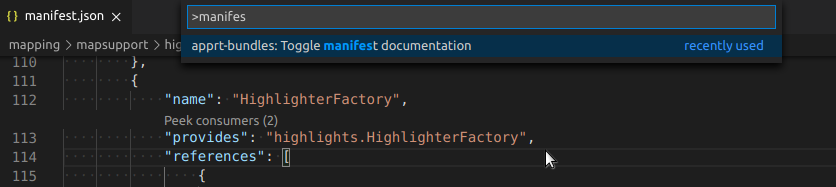

# v0.1.0

Version 0.1.0 brings these new features:

* **[Quick-open bundle](#quick-open-bundle)** - Quickly jump to a bundle by typing its name
* **[Hide documentation hints](#hide-documentation-hints)** - Hide documentation hovers when editing manifest.json files

Additionally, find all fixed issues in the [changelog](/CHANGELOG.md).

## Quick-open bundle

Sometimes it takes more time than you expect to locate the bundle inside the file tree of VS Code. This is where *Quick-open bundle* comes to a rescue:

Execute "apprt-bundles: Open bundle" from the **Command Palette**, enter some parts of the bundle name, and the bundle folder will be highlighted in the file tree.

The actual effect of *opening a bundle* can be customized in the **Settings**.
You can select if
* the bundle folder is just highlighted,
* the bundle folder is highlighted and expanded (`apprtbundles.bundles.reveal.goal.expandFolder`),
* the manifest.json file of the bundle folder is highlighted, which obviously requires to expand the folder :smirk: (`apprtbundles.bundles.reveal.goal.type`).

## Hide documentation hints

Hovering documentation hints for the elements of a manifest.json file can help a lot when you're not familiar with their meaning.
But when you _are_, they might too often get into your way when navigating around quickly.

You can now either temporarily or permanently turn them off (and on again, of course).
The **Command Palette** now has an entry "apprt-bundles: Toggle manifest documentation" to switch documentation hovers on and off.
If you still want to get rid of them permanently, set `apprtbundles.manifest.documentationTooltips.enabled` to `false` in the **Settings**.

