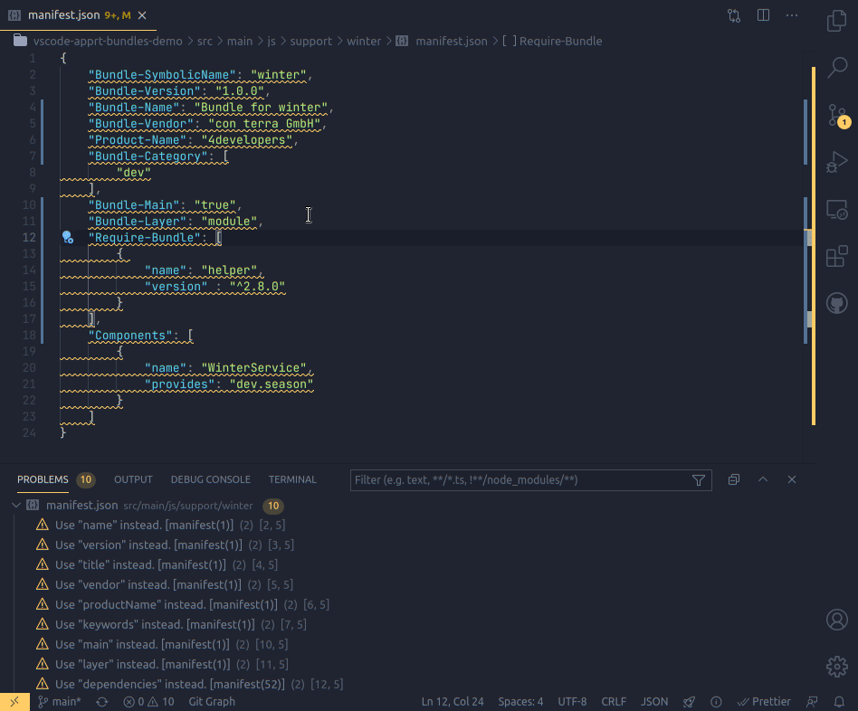

# 0.4.0

A small release with with a welcome remedy...

* **[Fix deprecation warnings](#fix-deprecation-warnings)** - Let VS Code fix manifest.json deprecation warnings.

## Fix deprecation warnings

When you've got this extension installed, it will underline any use of old-style manifest.json property names and mark them as deprecated.
If you want to keep your bundles clean, removing those deprecation manually can become a tedious task.

This release offers a new "Quick Fix" to replace a deprecated property by its new version.
There even is a quick fix action to _replace all deprected properties_ in the current manifest at once. 

See it action here:

To run a quick fix either click the light bulb on the regarding line, hover that line and click _> Qick Fix..._, or type <kbd>Ctrl</kbd>+<kbd>.</kbd>.
