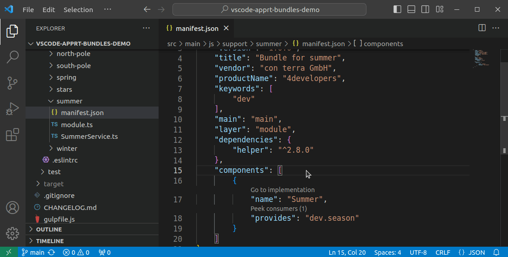

# 0.5

Version 0.5 improves already existing features making them easier to use.

* **[Go to component implementation](#go-to-component-implementation)** - From the manifest.json, jump to a component's implementing code with a single click on a code lens.
* **[New default keybinding](#go-to-bundle-keybinding)** - Get to the bundle selection list with a n easy-to-memorize keyboard shortcut.

## Go to component implementation

You will now see the "Go to implementation" code lens above the component name, which will take you to the the location inside the implementation file where the component is defined.

In previous versions you could already use <kbd>Ctrl</kbd>+<kbd>Click</kbd> (or hit <kbd>F12</kbd>, "Go to Definition") on a component `impl` property in the manifest to jump to its implementation file.
This was implemented based on guessing the implementation file name from the information available in the manifest.
As might seem obvious this will not work in all cases.

With this release the whole workflow was redesigned to reliably take you to the location in the implementation file exactly where the implementation class is defined.
This is done by analyzing the `export`'s and `import`'s of the `module.{js,ts}` and the code of the implementation file.

Other than in previous releases, pressing <kbd>Ctrl</kbd>+<kbd>Click</kbd> (or hitting <kbd>F12</kbd>, "Go to Definition") will now take you to the `module.{js,ts}` file, where the component is exported or imported.

## Go to bundle keybinding

Jumping from one bundle to another gets even easier with a new default keybinding that opens the bundles list: Press <kbd>Ctrl</kbd>+<kbd>ß</kbd>, (as in **ß**undle), type some letters of the bundle name, then <kbd>Enter</kbd>, and there you are!

<video controls width="800">
  <source src="../images/updates/v0.5.0/feature_bundle_open03.webm" type="video/webm" />
  Download the
  <a href="../images/updates/v0.5.0/feature_bundle_open03.webm">WEBM</a>
  video.
</video>

